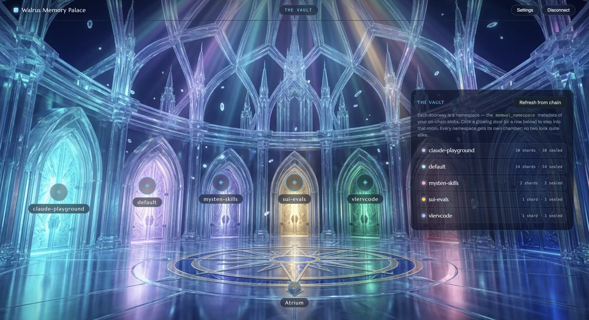

# Walrus Memory Palace


A sample app for the Walrus Memory SDK (`@mysten-incubation/memwal`), built as a
first-person crystal palace you click through, graphic-adventure style. It turns
one Walrus Memory account into a place you can walk: every room is a live view
over your on-chain memories.

| Room | What it shows | SDK / chain surface |
| --- | --- | --- |
| The Gates | connect (manual or one-click) | delegate key registration |
| The Atrium | account overview | `health()` + `MemWalAccount` chain read |
| The Vault | a rotunda — one glowing door per namespace | `listOwnedObjects` + `memwal_*` metadata |
| Namespace rooms | one crystal shard per memory on the shelves | `recall()` join ("Decrypt room") |
| The Observatory | semantic search | `recall()` |
| The Scriptorium | write & maintain | `remember()`, `analyze()`, `restore()` |

Each namespace hashes to one of six generated library variants, so every room
looks different at first sight — a little memory-palace of your own. Every panel
carries a "Show the SDK call" snippet with the exact call it runs, so the palace
doubles as a code tour of the SDK.

| The Vault — one door per namespace | A namespace room — one crystal per memory |
| --- | --- |
|  |  |

## How it reads your memories

The SDK has no "list all memories" call, on purpose: the relayer stores only
vectors and blob IDs, the plaintext lives SEAL-encrypted on Walrus, and **the
Sui chain is the source of truth for what exists**. The palace follows that
split:

- **Inventory comes from the chain.** The app lists your Walrus `Blob` objects
  and reads their `memwal_*` metadata. Each `memwal_namespace` becomes a room;
  each memory becomes a crystal in that room.
- **Text comes from `recall()`.** "Decrypt room" runs a broad `recall()` for the
  namespace and joins the returned plaintext onto the crystals by `blob_id`. A
  shard the search does not surface stays sealed — that is the privacy model
  working, not a bug.

## Run it

You need Node 20+ and [pnpm](https://pnpm.io).

```bash
git clone https://github.com/MystenLabs/walrus-memory-palace
cd walrus-memory-palace
pnpm install
pnpm dev
```

Open http://localhost:5183. Dev mode needs no `.env` file: the vite dev server
proxies relayer calls, because deployed relayers CORS-block direct `localhost`
calls. See `.env.example` for the optional overrides.

## Connect your account — use mainnet

The Gates ask for two credentials — the same values `MemWal.create()` takes:

- a delegate private key, and
- your `MemWalAccount` object ID

Get them from the Walrus Memory dashboard (https://memory.walrus.xyz), or reuse
the ones your MCP login saved in `~/.memwal/credentials.json`. The network
defaults to **mainnet**, which is what you want; it lives under "Advanced
options" alongside the relayer URL and endpoints. The key stays in your
browser's `localStorage`.

A one-click handoff is implemented but **not reachable from the UI**. It
generates a delegate key in your browser, has the dashboard register it with a
sponsored `add_delegate_key` transaction (no gas), and returns the result to the
palace tab over a same-origin `BroadcastChannel`. It needs the dashboard's
`/connect/app` route, which no deployment serves yet — requests there fall back
to the sign-in page with the connect parameters stripped. The code is parked in
`src/lib/connect.ts`; restore the button in `SettingsForm.tsx` once the route
ships.

## Optional: regenerate the artwork

**You don't need this to run the app** — every runtime asset already ships in
`public/palace/` and loads on `pnpm dev`. This section is only for redrawing the
palace.

The rooms are AI-generated (Higgsfield). `gen-src/` holds the reproducible
pipeline: `gen-scenes.sh` (prompts) → `gen-rest.sh` (style-locked interiors) →
`gen-rooms2-base.sh` / `gen-rooms2-recolor.sh` (the uniform-grid rooms in six
colours) → `rooms2-to-webp.py` / `shards-to-webp.py` (encode into
`public/palace/`). `gen-arrivals3.sh` renders the per-room fly-in clips that end
on each room still. Raw outputs are gitignored; the shipped assets live in
`public/palace/`.
